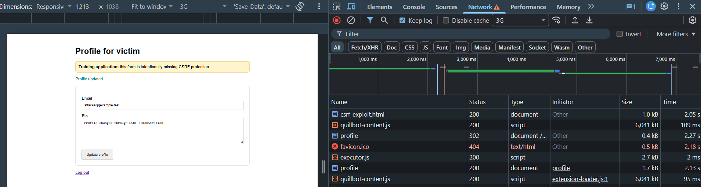
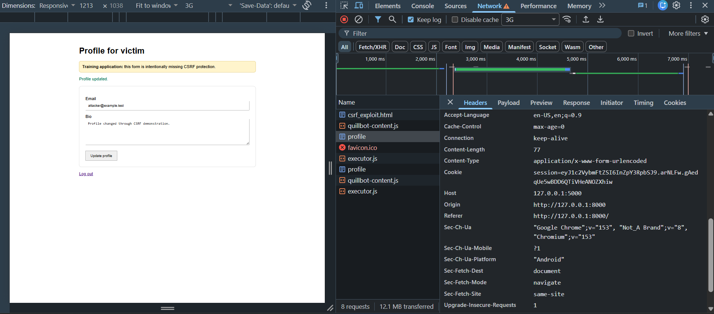
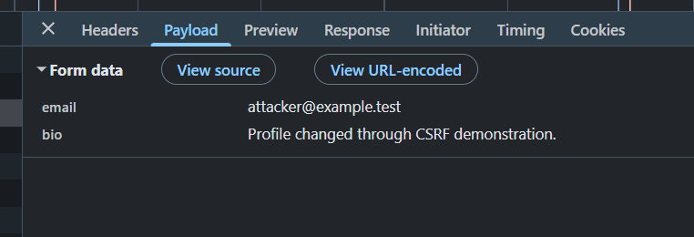
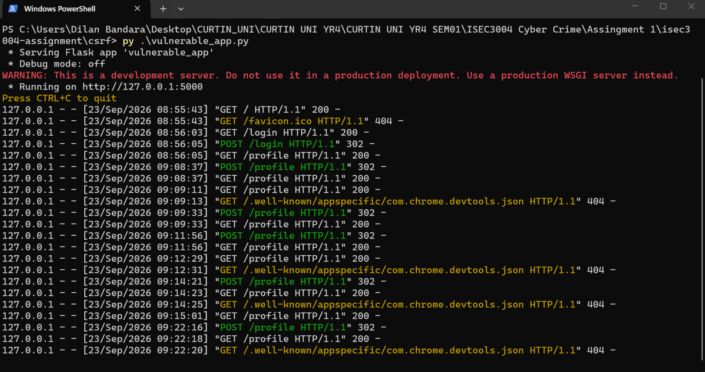
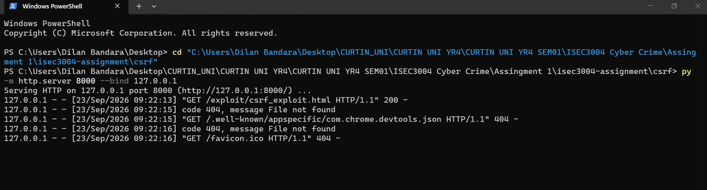

# CSRF Demo

A local demonstration of a Cross-Site Request Forgery (CSRF) vulnerability using fake data.

## Files

- `../vulnerable_app.py`: Runs the deliberately vulnerable Flask application on port `5000`.
- `../templates/login.html`: Login page for the demo victim account.
- `../templates/profile.html`: Profile form used for the state-changing profile update.
- `../templates/index.html`: Landing page for the local training application.
- `../exploit/csrf_exploit.html`: Attacker-controlled page that automatically submits a forged POST request to the victim profile endpoint.
- `../requirements.txt`: Python package requirements for the vulnerable application.

## Start the vulnerable application

Open PowerShell at the repository root.

### Enter the CSRF project folder

```powershell
cd csrf
```

### Install the required package if needed

```powershell
py -m pip install -r requirements.txt
```

### Start the vulnerable application

```powershell
py .\vulnerable_app.py
```

Leave this terminal running.

The application should be available at:

```text
http://127.0.0.1:5000/
```

## Log in to the victim account

Open the application in a browser and log in using the local demo credentials configured for the training application.

Then open:

```text
http://127.0.0.1:5000/profile
```

The profile page is intentionally missing CSRF protection.

## Start the attacker page

Open a second PowerShell terminal at the repository root.

### Enter the CSRF project folder

```powershell
cd csrf
```

### Start a local HTTP server

```powershell
py -m http.server 8000 --bind 127.0.0.1
```

Leave this terminal running.

The attacker page is available at:

```text
http://127.0.0.1:8000/exploit/csrf_exploit.html
```

## Run the exploit

Keep the victim logged in to the vulnerable application.

Open Chrome Developer Tools and select the **Network** tab. Enable **Keep log**.

Then open:

```text
http://127.0.0.1:8000/exploit/csrf_exploit.html
```

The exploit page automatically submits a POST request to:

```text
http://127.0.0.1:5000/profile
```

The forged request contains attacker-controlled profile values.

## Exploit result

The browser trace showed the following sequence:

```text
GET /exploit/csrf_exploit.html  -> 200
POST /profile                   -> 302
GET /profile                    -> 200
```

The malicious POST request targeted:

```text
http://127.0.0.1:5000/profile
```

while the request originated from:

```text
http://127.0.0.1:8000
```

The captured form data was:

```text
email = attacker@example.test
bio   = Profile changed through CSRF demonstration.
```

After the forged request was accepted, the victim profile displayed the attacker-controlled values.

### Browser attack sequence



### Malicious request headers

The malicious request showed a different origin from the victim application:

```text
Origin:  http://127.0.0.1:8000
Referer: http://127.0.0.1:8000/
Host:    127.0.0.1:5000
```



### Malicious request payload



## Detection and tracing

A legitimate profile update was first captured as a baseline. Its request originated from the victim application itself:

```text
Origin:  http://127.0.0.1:5000
Referer: http://127.0.0.1:5000/profile
Sec-Fetch-Site: same-origin
```

The CSRF request differed because it originated from port `8000` while targeting the victim application on port `5000`.

The vulnerable Flask server recorded the forged state-changing request as:

```text
POST /profile HTTP/1.1 302
GET /profile HTTP/1.1 200
```

The attacker-side HTTP server recorded the exploit page load:

```text
GET /exploit/csrf_exploit.html HTTP/1.1 200
```

These traces link the attacker page load, forged POST request, server processing, redirect, and final unauthorized profile change.

### Victim application server trace



### Attacker HTTP server trace



## Stop the applications

Press `Ctrl+C` in the terminal running `vulnerable_app.py`.

Press `Ctrl+C` in the terminal running the port `8000` HTTP server.

## Scope

This demonstration is designed only for the local ISEC3004 training environment using fake data.
