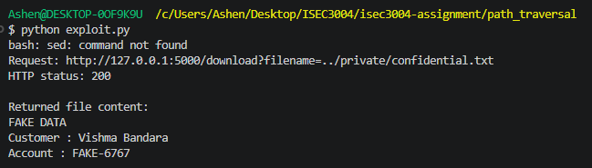

# Path Traversal Demo

A local demonstration using fake data.

## Files

- `vulnerable_app.py`: Runs a Flask file-download endpoint. It joins
  user input to the downloads folder without checking that the resulting
  path stays inside it, allowing path traversal.
- `exploit.py`: Sends a request containing `../private/confidential.txt`
  and prints the HTTP status and returned file contents. It uses Python’s
  built-in libraries, so no additional package is needed.

## Start the application

Open PowerShell at the repository root:


## Enter the project folder
```
cd path_traversal
```
## Install Flask if needed
```
python -m pip install Flask==3.1.3
```
## Start the vulnerable application
```
python vulnerable_app.py
```

Leave this terminal running.

## Test the normal download

Open this URL in your browser:

```
http://127.0.0.1:5000/download?filename=welcome.txt
```

Expected result: the public welcome.txt file downloads.

## Run the exploit

Open a second PowerShell terminal at the repository root:


## Enter the project folder
```
cd path_traversal
```

## Run the exploitation script
```
python exploit.py
```
## Example result



Expected result: HTTP status 200 and the fake data from
private/confidential.txt appear in the terminal. The returned contents
confirm that the app accessed a file outside downloads.

## Stop the application

Press Ctrl+C in the terminal running vulnerable_app.py.